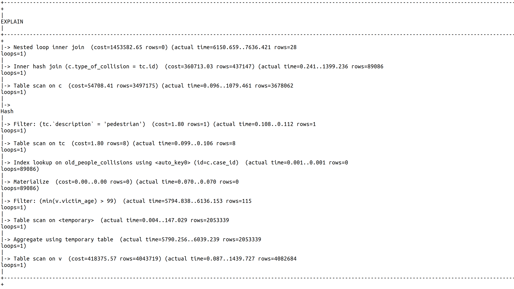
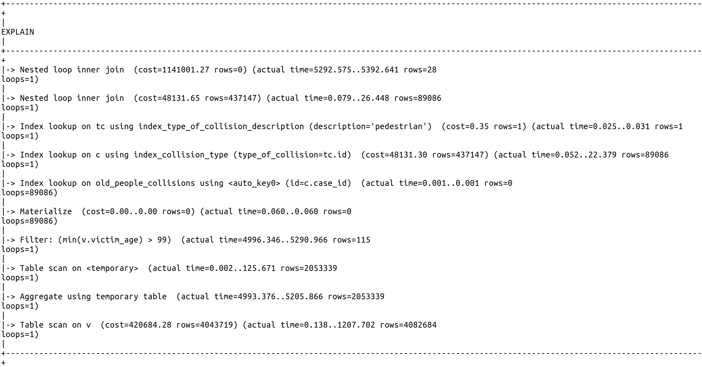
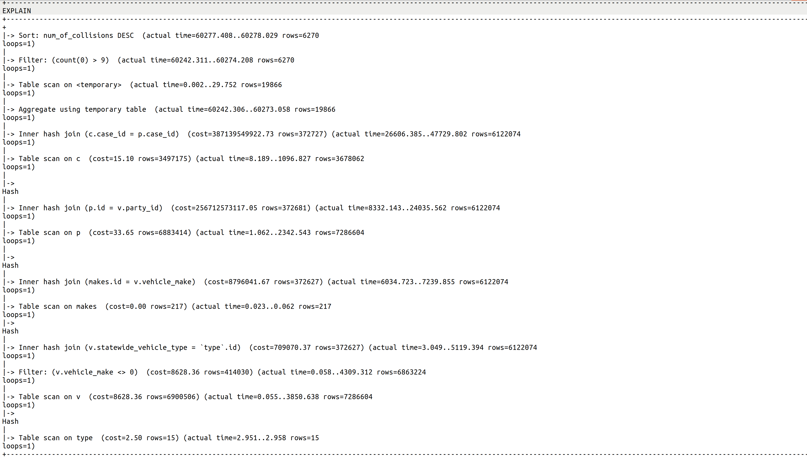
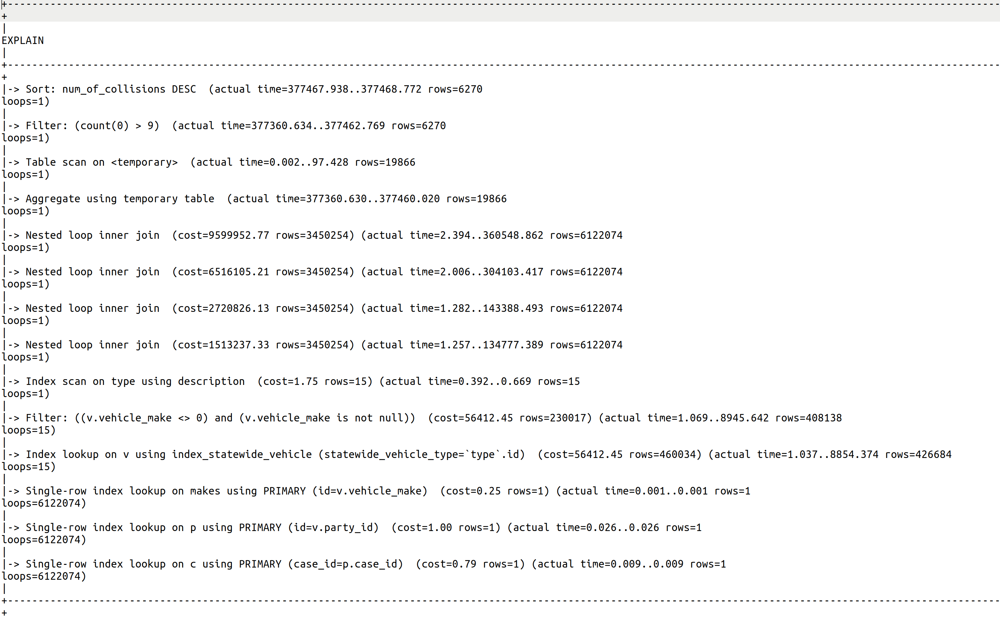
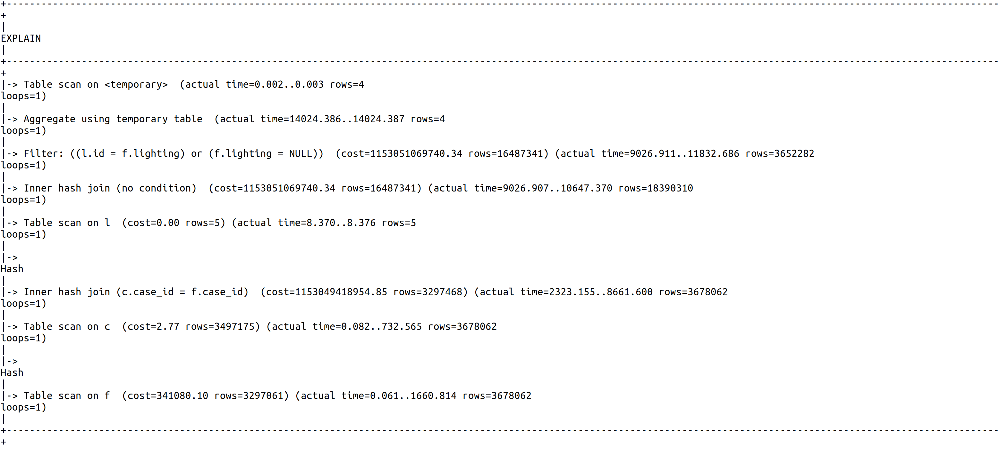
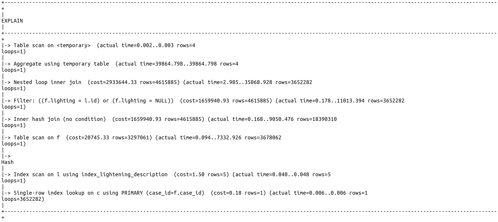

# ER Model


# Data constraints

## Participation constraints

- Partial participation from `Collision` in the `involved in` relationship:
        `case_id` `10` has no involved party.
- 'Exactly one' participation from `Party` in the `involved in` relationship:
        Every party has an associated `case_id` that is unique.
- Partial participation from `Party` in the 'associated with' relationship:
        Some `case_id` have no victim e.g. `case_id` `1,2`.
- 'Exactly one' participation from `Victim` in the `associated with` relationship:
        Given a `case_id`, if there is a victim, there is a party (unique).

## Additional constraints

 * In the project description, each attribute that is nullable is clearly stated: 

        > Blank or - - Not Stated
   Hence we can mark as `NOT NULL` every other attribute, except for `PRIMARY KEY`s, which are implicitely so.
 * Since we are using a star schema, we cannot express the following constraints in the SQL code: every collision has a location, a factor, a pcf and a case. Likewise, every party has a vehicle and a party context. Finally, every victim has a victim context. 
 * As said in the moodle forum, a victim is not a party.

# Design choices

## Star schema

We decided to cluster attributes into separate entities following a star schema. Some groups are obvious, others are debatable.

The obvious groups are:

 * For the `Collision` entity, some attributes form the logical groups `Pcf`, `Location`, `Factor`, `Case`.
 * Similarly, for the `Victim` entity, the only logical group is `Vehicle`.

 We also decided to add two less obvious groups:
 * For the `Party` entity, attributes which are orthogonal to the collision are not stored in a separate entity (age, sex, ...)

    Attributes which are about the context of the collision are stored in a `PartyContext` entity.

 * Similarly for the `Victim` entity, we have a `VictimContext` entity.

## Attribute types in the SQL code

 * In the project description, some attributes are enums: they can only take on specific pre-defined values. 
 Therefore, we can let them be `INTEGER` and have lookup tables when we dump the `.csv`s into a `SQL` database. 
 
    The alternative would be to let them be `VARCHAR`. The problem with this approach is that determining the max length means looking up the max number of characters for each attribute. 
    
    Granted: creating lookup tables would require the same amount of work; however it leads to  substantial data compression.
 
    Note that these attributes are the same that are `nullable`.

 * Similarly, `tow_away` from `Collisions` can be translated from a `float` (`0.0` or `1.0`) to a `BIT`.

 * The rest of the attributes are clearly `INTEGER` from the project description as well as upon inspection of the values in the `.csv` files.

# SQL code

## Collision

### Main Tables

```SQL
CREATE TABLE Collisions(case_id VARCHAR(19), 
                        collision_date DATE NOT NULL,
                        collision_time TIME,
                        type_of_collision INTEGER,
                        collision_severity INTEGER NOT NULL,
                        hit_and_run INTEGER NOT NULL,
                        tow_away BIT,
                        FOREIGN KEY(type_of_collision) REFERENCES TypeOfCollision(id), 
                        FOREIGN KEY(collision_severity) REFERENCES CollisionSeverity(id), 
                        FOREIGN KEY(hit_and_run) REFERENCES HitAndRun(id),                      
                        PRIMARY KEY(case_id))
```

```SQL
CREATE TABLE Pcfs(case_id VARCHAR(19) NOT NULL,
                    pcf_violation INTEGER,
                    pcf_violation_category INTEGER,
                    pcf_violation_subsection CHAR(1),
                    FOREIGN KEY(pcf_violation_category) REFERENCES PcfViolationCategory(id),
                    FOREIGN KEY(case_id) REFERENCES Collisions(case_id))
```

```SQL
CREATE TABLE Locations(case_id VARCHAR(19) NOT NULL,
                        population INTEGER,
                        county_city_location INTEGER NOT NULL,
                        FOREIGN KEY(case_id) REFERENCES Collisions(case_id))
```

```SQL
CREATE TABLE Factors(case_id VARCHAR(19) NOT NULL,
                        location_type INTEGER,
                        lighting INTEGER,
                        road_condition_1 INTEGER,
                        road_condition_2 INTEGER,
                        road_surface INTEGER,
                        weather_1 INTEGER,
                        weather_2 INTEGER,
                        FOREIGN KEY(location_type) REFERENCES LocationType(id),
                        FOREIGN KEY(lighting) REFERENCES Lighting(id),
                        FOREIGN KEY(road_condition_1) REFERENCES RoadCondition(id),
                        FOREIGN KEY(road_condition_2) REFERENCES RoadCondition(id),
                        FOREIGN KEY(road_surface) REFERENCES RoadSurface(id),
                        FOREIGN KEY(weather_1) REFERENCES Weather(id),
                        FOREIGN KEY(weather_2) REFERENCES Weather(id),
                        FOREIGN KEY(case_id) REFERENCES Collisions(case_id))
```

```SQL
CREATE TABLE Cases(case_id VARCHAR(19) NOT NULL,
                    process_date DATE NOT NULL,
                    officer_id VARCHAR(8),
                    jurisdiction INTEGER,
                    FOREIGN KEY(case_id) REFERENCES Collisions(case_id))
```

### Satelite Enum Tables

```SQL
CREATE TABLE CollisionSeverity(id INTEGER AUTO_INCREMENT,
			       description VARCHAR(25) NOT NULL UNIQUE,
			       PRIMARY KEY(id))
```

```SQL
CREATE TABLE HitAndRun(id INTEGER AUTO_INCREMENT,
			description VARCHAR(20) NOT NULL UNIQUE,
			PRIMARY KEY(id))
```

```SQL
CREATE TABLE Lighting(id INTEGER AUTO_INCREMENT,
		       description VARCHAR(39) NOT NULL UNIQUE,
		       PRIMARY KEY(id))
```

```SQL
CREATE TABLE LocationType(id INTEGER AUTO_INCREMENT,
			   description VARCHAR(20) NOT NULL UNIQUE,
			   PRIMARY KEY(id))
```

```SQL
CREATE TABLE PcfViolationCategory(id INTEGER AUTO_INCREMENT,
				   description VARCHAR(70) NOT NULL UNIQUE,
				   PRIMARY KEY(id))
```

```SQL
CREATE TABLE PrimaryCollisionFactor(id INTEGER AUTO_INCREMENT,
				     description VARCHAR(25) NOT NULL UNIQUE,
				     PRIMARY KEY(id))
```

```SQL
CREATE TABLE RoadCondition(id INTEGER AUTO_INCREMENT,
			    description VARCHAR(20) NOT NULL UNIQUE,
			    PRIMARY KEY(id))
```

```SQL
CREATE TABLE RoadSurface(id INTEGER AUTO_INCREMENT,
			  description VARCHAR(15) NOT NULL UNIQUE,
			  PRIMARY KEY(id))
```


```SQL
CREATE TABLE TypeOfCollision(id INTEGER AUTO_INCREMENT,
			      description VARCHAR(15) NOT NULL UNIQUE,
			      PRIMARY KEY(id))
```

```SQL
CREATE TABLE Weather(id INTEGER AUTO_INCREMENT,
		      description VARCHAR(10) NOT NULL UNIQUE,
		      PRIMARY KEY(id))
```

## Party

### Main Tables

```SQL
CREATE TABLE Parties(id INTEGER,
                        case_id VARCHAR(19) NOT NULL,
                        party_number INTEGER NOT NULL,
                        party_type INTEGER,
                        finanicial_responsibility INTEGER,
                        party_age INTEGER,
                        party_sex INTEGER,
                        at_fault BIT NOT NULL,
                        cellphone_use INTEGER,
                        hazardous_materials CHAR(1),
                        movement_preceding_collision INTEGER,
                        other_associate_factor_1 INTEGER,
                        other_associate_factor_2 INTEGER,
                        party_drug_physical INTEGER,
                        party_safety_equipment_1 INTEGER,
                        party_safety_equipment_2 INTEGER,
                        party_sobriety INTEGER,
                        PRIMARY KEY(id, case_id),
                        FOREIGN KEY(party_type) REFERENCES PartyType(id),
                        FOREIGN KEY(finanicial_responsibility) REFERENCES FinancialResponsability(id),
                        FOREIGN KEY(party_sex) REFERENCES PersonSex(id),
                        FOREIGN KEY(cellphone_use) REFERENCES CellphoneUse(id),
                        FOREIGN KEY(movement_preceding_collision) REFERENCES MovementPrecedingCollision(id),
                        FOREIGN KEY(other_associate_factor_1) REFERENCES OtherAssociatedFactors(id),
                        FOREIGN KEY(other_associate_factor_2) REFERENCES OtherAssociatedFactors(id),
                        FOREIGN KEY(party_drug_physical) REFERENCES PartyDrugPhysical(id),
                        FOREIGN KEY(party_safety_equipment_1) REFERENCES PartySafetyEquipement(id),
                        FOREIGN KEY(party_safety_equipment_2) REFERENCES PartySafetyEquipement(id),
                        FOREIGN KEY(party_sobriety) REFERENCES PartySobriety(id),
                        FOREIGN KEY(case_id) REFERENCES Collisions(case_id))
```

```SQL
CREATE TABLE Vehicles(party_id INTEGER NOT NULL,
                        school_bus_related BIT,
                        statewide_vehicle_type INTEGER,
                        vehicle_make INTEGER,
                        vehicle_year INTEGER,
                        FOREIGN KEY(statewide_vehicle_type) REFERENCES StatewideVehiculeType(id),
                        FOREIGN KEY(vehicle_make) REFERENCES VehiculeMake(id),
                        FOREIGN KEY(party_id) REFERENCES Parties(id))
```

### Satelite Enum Tables

```SQL
CREATE TABLE CellphoneUse(id INTEGER AUTO_INCREMENT,
			   description CHAR(1) NOT NULL UNIQUE,
                CHECK (description BETWEEN 'B' AND 'D'),	
			   PRIMARY KEY(id))
```

```SQL
CREATE TABLE FinancialResponsibility(id INTEGER AUTO_INCREMENT,
			   	      description CHAR(1) NOT NULL UNIQUE,
                                      CHECK (description IN ('N', 'Y', 'O', 'E')),	
			              PRIMARY KEY(id))
```

```SQL
CREATE TABLE MovementPrecedingCollision(id INTEGER AUTO_INCREMENT,
					 description VARCHAR(100) NOT NULL UNIQUE,
					 PRIMARY KEY(id))
```

```SQL
CREATE TABLE OtherAssociatedFactors (id INTEGER AUTO_INCREMENT,
    description CHAR(1) NOT NULL UNIQUE,
    CHECK (description BETWEEN 'A' AND 'Z'),
    PRIMARY KEY(id))				     
```

```SQL
CREATE TABLE PartyDrugPhysical(id INTEGER AUTO_INCREMENT,
			       description CHAR(1) NOT NULL UNIQUE,
                            CHECK (description IN ('E', 'F', 'H', 'I')),
			       PRIMARY KEY(id))
```

```SQL
CREATE TABLE PartySafetyEquipement(id INTEGER AUTO_INCREMENT,
				   description CHAR(1) NOT NULL UNIQUE,
                                   CHECK (description BETWEEN 'A' AND 'Y'),
				   PRIMARY KEY(id))
```

The following can store `victim_sex` and `party_sex`
```SQL 
CREATE TABLE PersonSex(id INTEGER AUTO_INCREMENT,
		       description VARCHAR(6) NOT NULL UNIQUE,
                       CHECK (description in ('male', 'female')),
		       PRIMARY KEY(id))
```

```SQL
CREATE TABLE PartySobriety(id INTEGER AUTO_INCREMENT,
			    description CHAR(1) NOT NULL UNIQUE,
                            CONSTRAINT sobriety_check CHECK (description IN ('A', 'B', 'C', 'D', 'G', 'H')),
			    PRIMARY KEY(id))
```

```SQL
CREATE TABLE PartyType(id INTEGER AUTO_INCREMENT,
			description VARCHAR(14) NOT NULL UNIQUE,
			PRIMARY KEY(id))
```


```SQL
CREATE TABLE StatewideVehiculeType(id INTEGER AUTO_INCREMENT,
				    description VARCHAR(35) NOT NULL UNIQUE,
				    PRIMARY KEY(id))
```

```SQL
CREATE TABLE VehiculeMake(id INTEGER AUTO_INCREMENT,
			   description VARCHAR(28) NOT NULL,
			   PRIMARY KEY(id))
```

## Victim

### Main Table

```SQL
CREATE TABLE Victims(id INTEGER,
                        case_id VARCHAR(19) NOT NULL,
                        party_number INTEGER NOT NULL,
                        victim_age INTEGER,
                        victim_sex INTEGER,
                        victim_degree_of_injury INTEGER,
                        victim_ejected INTEGER,
                        victim_role INTEGER NOT NULL,
                        victim_safety_equipment_1 INTEGER,
                        victim_safety_equipment_2 INTEGER,
                        victim_seating_position INTEGER,
                        PRIMARY KEY(id, case_id),
                        FOREIGN KEY(victim_sex) REFERENCES PersonSex(id),
                        FOREIGN KEY(victim_safety_equipment_1) REFERENCES VictimSafetyEquipment(id),
                        FOREIGN KEY(victim_safety_equipment_2) REFERENCES VictimSafetyEquipment(id),
                        FOREIGN KEY(victim_degree_of_injury) REFERENCES VictimDegreeOfInjury(id),
                        FOREIGN KEY(case_id) REFERENCES Collisions(case_id))
```

### Satelite Enum Tables

```SQL
CREATE TABLE VictimSafetyEquipment(id INTEGER AUTO_INCREMENT,
				   description CHAR(1) NOT NULL UNIQUE,
                                   CHECK(description BETWEEN 'A' AND 'Z'),
				   PRIMARY KEY(id))
```

```SQL
CREATE TABLE VictimDegreeOfInjury(id INTEGER AUTO_INCREMENT,
				   description VARCHAR(30) NOT NULL UNIQUE,
				   PRIMARY KEY(id))
```

The following can store `victim_sex` and `party_sex`.

```SQL 
CREATE TABLE PersonSex(id INTEGER AUTO_INCREMENT,
		       description VARCHAR(6) NOT NULL UNIQUE,
                       CHECK (description in ('male', 'female')),
		       PRIMARY KEY(id))
```

# Design modifications

## Justifications

We made certain design modifications to respond to the feedback that we got after the last deliverable. 

> Think about the repeated information stored in rows of your table with your current entity modeling. As a thought experiment, if 1000 accidents took place in the same county_city_location "Lausanne", it would not be efficient to repeatedly store "Lausanne" 1000 times in the rows of our collision table. We'd prefer to store it only once as a single row in a separate location entity, and reference it. Apply this logic to your modeling structure, starting with the feedback below.

Firstly, to avoid having to store certain strings over and over again, we created satellite enum tables to which we reference from within our main entities. 

> Consider modeling "other_associated_factors" as a separate entity. Consider modeling road conditions and weather as separate entities.

The satellite table modeling also responded to this point of the feedback by making weather, road conditions and other_associated_factors a separate entity. 

To be consistant throughout the columns, we had to model any column like the ones mentioned as separate entities. There are too much of these to mention here.

> There is no strong benefit to creating "Party Contexts" and "Victim Contexts" entities separate from your Party and Victim entities, because all this requires is more joining at query time

We removed the Party Context and Victim Context entities and simply merged their attributes to the ones in the Party and Victim entities.

> Please justify your decision to model safety equipment-related information as fields of victims and party instead of migrating them to a separate 'Safety Equipment' entity.

We decided to keep safety equipment related attributes inside the Party and Victim entities instead of migrating them to a separate safety equipment entity. This is because since these attributes exist individually for victims and parties, it seemed more logical to us to keep them with those entities rather than creating a new entity that would hold information for different types of participants in the collision.

> Strong vs. weak entities: consider converting currently-modeled-as-strong, non-uniquely identifiable entities to weak ones. For example, parties can be modeled as a weak entity, as they only exist in the context of a collision.

We noticed that both Victim and Party entities were modeled as strong entities. In order to turn these into weak entities, as suggested, we added a foreign key : the case id. 

## Disclaimer

Last second we realized that having `DECIMAL(19)` as the type of `case_id` was not suitable. 

Although `pandas` indicated `float64` as the type for `case_id`, it seems like there are leading `0` for some values of this column in `collisions.csv`.

Therefore in the future we will have to change the `case_id` type to `VARCHAR(M)` where `M` is the longest string representing a `case_id`. We will also need to load the data in a different way, overriding `pandas` assumed type for `case_id`.

This mistake led us to have some collisions dropped as well their associated victims and parties. The queries below will therefore probably yield slightly less reliable values than expected.

# How we did the import

The following is implementation details that we inserted for completion.

## The database server

We decided to run `MySQL` locally after failing to get acceptable performances on AWS/GCP.

## The method to dump data

* After having declared every table, we simply performed a row-wise import, using `pd.iterrows` and `INSERT INTO` commands.

* Sattelite tables were populated on the fly.

* `id`s from such Sattelite tables were cached during import for performance.

# Data cleaning choices

## Collisions

* `Collisions` has three columns with dirty values. 

* The columns are  `hit_and_run`, `pcf_violation_category` and `road_surface`. The corresponding values are `D`, `21804` and `H`.

* The above anomalies each occur once in the table.

* Droping a collision means dropping the associated parties and victims. In our case, we dropped 1 victim and 2 parties. 

* Surprisingly, it was a single row combining the above three anomalies. The corresponding `case_id` was `2816618`.

## Parties 

* `Parties` has two columns with dirty values. 

* In `party_drug_physical` there is an undefined `G` which is converted into a `NULL` in the table. Even if this value is the most prevalant in the table, we decided to replace with `NULL` as we cannot interpret it.

* In `cellphone_use`, undefined values `1`, `2` and `3` are converted into `B`, `C` and `D` respectively. We made this choice because of similar frequency as well as similar order.

## Victims

* In the table `Victims`, `victim_degree_of_injury` has an undefined `7` which is replaced by `NULL`. This occurs once throughout the table.

# Queries - Deliverable 2

As asked, we only included the first 20 rows or less.

## Query 1

List the year and the number of collisions per year. Suppose there are more years than just 2018.

## Command

```SQL
SELECT
  EXTRACT(
    YEAR
    FROM
      c.collision_date
  ) as year,
  COUNT(*) as collisions_count
FROM
  Collisions c
GROUP BY
  EXTRACT(
    YEAR
    FROM
      c.collision_date
  )
```

## Result

year | collisions_count
:---: | :---:
2002 | 544741
2003 | 538953
2004 | 538294
2005 | 532724
2006 | 498849
2007 | 501908
2017 | 7
2018 | 21
2001 | 518985

## Query 2

Find the most popular vehicle make in the database. Also list the number of vehicles of that particular
make.

## Command

```SQL
CREATE VIEW MostPopularVehicle AS (
  SELECT
    COUNT(p.id) as number_of_vehicles,
    v.vehicle_make as brand_id
  FROM
    Parties p,
    Vehicles v
  WHERE
    p.id = v.party_id
  GROUP BY
    v.vehicle_make
  ORDER BY
    number_of_vehicles DESC
  LIMIT
    1
)

SELECT
  vm.description as brand,
  vp.number_of_vehicles as vehicle_count
FROM
  VehiculeMake vm,
  MostPopularVehicle vp
WHERE
  vm.id = 1
```

## Result

brand | vehicle_count
:---: | :---:
FORD | 1129719

## Query 3

Find the fraction of total collisions that happened under dark lighting conditions.

## Command

```SQL
SELECT
  (
    SELECT
      COUNT(*)
    FROM
      (
        SELECT
          c.case_id
        FROM
          Collisions c,
          Factors f,
          Lighting l
        WHERE
          c.case_id = f.case_id
          AND f.lighting = l.id
          AND l.description LIKE 'dark%'
      ) AS DarkCols
  ) / (
    SELECT
      COUNT(*)
    FROM
      Collisions
  )
```

## Result

|fraction|
|:---:|
|0.2802|

# Query 4

Find the number of collisions that have occurred under snowy weather conditions.

## Command

```SQL
SELECT
  COUNT(snowy.case_id)
FROM
  Collisions snowy,
  Factors f,
  Weather w
WHERE
  snowy.case_id = f.case_id
  AND (
    f.weather_1 = w.id
    OR f.weather_2 = w.id
  )
  AND w.description LIKE 'snowing'
```

## Result

|count|
|:---:|
|8542|

# Query 5

Compute the number of collisions per day of the week, and find the day that witnessed the highest
number of collisions. List the day along with the number of collisions.

## Command

```SQL
SELECT 
  CASE DAYOFWEEK(collision_date) 
    WHEN 1 THEN 'Sunday'
    WHEN 2 THEN 'Monday'
    WHEN 3 THEN 'Tuesday'
    WHEN 4 THEN 'Wednesday'
    WHEN 5 THEN 'Thursday'
    WHEN 6 THEN 'Friday'
    ELSE 'Saturday'
  END as day, 
  COUNT(*) as counts 
FROM   Collisions
GROUP BY day
ORDER BY counts desc
LIMIT 1
```

## Result

day | count
:---:|:---:
Friday|614143

# Query 6

List all weather types and their corresponding number of collisions in descending order of the number
of collisions.

## Command

```SQL
SELECT
  CASE weather
    WHEN 1 THEN 'clear'
    WHEN 2 THEN 'cloudy'
    WHEN 3 THEN 'fog'
    WHEN 4 THEN 'other'
    WHEN 5 THEN 'raining'
    WHEN 6 THEN 'snowing'
    ELSE 'wind'
  END AS weather_type,
  SUM(counts) as count
FROM
  (
    SELECT
      f.weather_1 as weather,
      COUNT(*) as counts
    FROM
      Factors f
    GROUP BY
      f.weather_1
    UNION ALL
    SELECT
      f.weather_2 as weather,
      COUNT(*) as counts
    FROM
      Factors f
    GROUP BY
      f.weather_2
  ) AS WeatherList
GROUP BY
  weather
ORDER BY
  counts DESC
```

## Result

weather_type | count
:---: | :---:
wind | 3592379
clear | 2941042
cloudy | 548250
snowing | 223752
fog | 21259
wind | 13952
other | 8530
raining | 6960

# Query 7

Find the number of at-fault collision parties with financial responsibility and loose material road
conditions.

## Command

```SQL
SELECT
  COUNT(*)
FROM
  Parties p,
  Factors f
WHERE
  p.at_fault = 1
  AND p.financial_responsibility IN (
    SELECT
      id
    FROM
      FinancialResponsibility
    WHERE
      description = 'Y'
  )
  AND f.case_id = p.case_id
  AND (
    f.road_condition_1 IN (
      SELECT
        id
      FROM
        RoadCondition
      WHERE
        description = 'loose material'
    )
    OR f.road_condition_2 IN (
      SELECT
        id
      FROM
        RoadCondition
      WHERE
        description = 'loose material'
    )
  )
```

## Result

|count|
|:---:|
|4818|

# Query 8

Find the median victim age and the most common victim seating position.

## Command

```SQL
CREATE INDEX index_victim_age ON Victims(victim_age)

SET @rowindex := -1;
 
SELECT b.seating_position as seating_position, a.median as median
FROM 
  (SELECT
    AVG(d.age) as median
  FROM
    (SELECT @rowindex:=@rowindex + 1 AS rowindex,
            v.victim_age AS age
      FROM Victims v
      ORDER BY v.victim_age) AS d
  WHERE
  d.rowindex IN (FLOOR(@rowindex / 2), CEIL(@rowindex / 2))) a,
  (SELECT
    victim_seating_position as seating_position
  FROM
    Victims
  GROUP BY
    victim_seating_position
  ORDER BY
    COUNT(*) DESC
  LIMIT
    1) b
```

## Result

|seating_position|median|
|:---:|:---:|
|3|24|

# Query 9

What is the fraction of all participants that have been victims of collisions while using a belt?

## Command

```SQL
SELECT
  (
    (
      SELECT
        COUNT(V.case_id)
      FROM
        Victims V,
        VictimSafetyEquipment S
      WHERE
        (
          V.victim_safety_equipment_1 = S.id
          OR V.victim_safety_equipment_2 = S.id
        )
        AND S.description IN ('C', 'E', 'G')
    ) / ((SELECT COUNT(*) FROM Victims) + (SELECT COUNT(*) FROM Parties))
  )
```

## Result

|fraction|
|:---:|
|0.2691|

# Query 10

Compute and the fraction of the collisions happening for each hour of the day (for example, x% at 13,
where 13 means period from 13:00 to 13:59). Display the ratio as percentage for all the hours of the day.

## Command

```SQL
SELECT
   TIME_FORMAT(collision_time, "%h%p") AS hour_ranges
   count(1) * 100.0 / (SELECT COUNT(*) FROM Collisions) as percents
 FROM
   Collisions
 GROUP BY
   hour_ranges
```

## Result

hour_ranges | percents
:---: | :---:
03PM | 7.74805
07PM | 4.42864
07AM | 5.17068
11AM | 4.89138
05PM | 7.90707
04PM | 7.33087
08AM | 5.23360
06AM | 2.62328
12PM | 5.77554
11PM | 2.38452
10PM | 2.86186
10AM | 4.22712
02AM | 1.80804
02PM | 6.54758
01AM | 1.82982
09AM | 4.08810
06PM | 6.30052
01PM | 5.77527
09PM | 3.28186
08PM | 3.48964
05AM | 1.44671
12AM | 1.90845
None | 0.80600
03AM | 1.15409
04AM | 0.98130

# Queries - Deliverable 3

# Query 1

## Comand

```SQL
SELECT
  q1.AgeGroup as age_group,
  q2.Count * 100.0 / q1.Count AS percentage
FROM
  (
    SELECT
      CASE WHEN party_age BETWEEN 0
      AND 18 THEN 'Underage' WHEN party_age BETWEEN 19
      AND 21 THEN 'Young I' WHEN party_age BETWEEN 22
      AND 24 THEN 'Young II' WHEN party_age BETWEEN 24
      AND 60 THEN 'Adult' WHEN party_age BETWEEN 61
      AND 64 THEN 'Elder I' ELSE 'Elder II' END AS AgeGroup,
      count(1) AS Count
    FROM
      Parties
    GROUP BY
      AgeGroup
  ) q1
  INNER JOIN (
    SELECT
      CASE WHEN p.party_age BETWEEN 0
      AND 18 THEN 'Underage' WHEN p.party_age BETWEEN 18
      AND 21 THEN 'Young I' WHEN p.party_age BETWEEN 21
      AND 24 THEN 'Young II' WHEN p.party_age BETWEEN 24
      AND 60 THEN 'Adult' WHEN p.party_age BETWEEN 60
      AND 64 THEN 'Elder I' ELSE 'Elder II' END AS AgeGroup,
      count(1) AS Count
    FROM
      Parties p
    WHERE
      p.at_fault = true
      AND p.party_type IN (SELECT id FROM PartyType WHERE description='driver')
    GROUP BY
      AgeGroup
  ) q2 ON q1.AgeGroup = q2.AgeGroup
```

## Result

age_group | percentage
:---: | :---:
Young I | 56.28855
Underage | 56.44656
Adult | 40.01389
Elder II | 43.00967
Young II | 50.83931
Elder I | 38.93744

# Query 2

## Command

```SQL 
SELECT vt.description , COUNT(*)
FROM(
    SELECT p.id 
    FROM Collisions c, Factors f, RoadCondition r, Parties p
    WHERE c.case_id = f.case_id AND( 
        r.id = f.road_condition_1 OR 
        r.id = f.road_condition_2) AND
        r.description = 'holes' AND
        c.case_id = p.case_id ) AS parties_holes , Vehicles v , StatewideVehiculeType vt
WHERE parties_holes.id = v.party_id AND
      vt.id = v.statewide_vehicle_type
GROUP BY v.statewide_vehicle_type
ORDER BY COUNT(*) DESC
LIMIT 5
```

## Result

vehicule_type | count
:---: | :---:
passenger car | 10662
pickup or panel truck | 2263
motorcycle or scooter | 450
bicycle | 430
truck or truck tractor with trailer | 369

# Query 3

## Command

```SQL
SELECT
  make.description,
  COUNT(*)
FROM
  Vehicles v,
  Victims vict,
  Parties p,
  VehiculeMake make,
  VictimDegreeOfInjury injury
WHERE
  v.party_id = p.id
  AND vict.case_id = p.case_id
  AND v.vehicle_make = make.id
  AND vict.victim_degree_of_injury = injury.id
  AND (
    injury.description = 'Killed'
    OR injury.description = 'Severe Injury'
  )
GROUP BY
  v.vehicle_make
ORDER BY
  COUNT(*) DESC
LIMIT 10 
```

## Result

vehicule_make | number_of_collisions
:---: | :---:
FORD | 31727
CHEVROLET | 22835
TOYOTA | 22292
HONDA | 20212
DODGE | 9028
NISSAN | 8070
GMC | 4696
NOT STATED | 4172
HARLEY-DAVIDSON | 3810
MISCELLANEOUS | 3753

# Query 4

## Command

Part 1: computing the safety index for each.
```SQL
SELECT
  q1.SeatingPosition,
  q2.Count / q1.Count AS SafetyIndex
FROM
  (
    SELECT
      CASE WHEN victim_seating_position BETWEEN 1
      AND 1 THEN 'Driver' WHEN victim_seating_position BETWEEN 2
      AND 6 THEN 'Passenger' WHEN victim_seating_position BETWEEN 7
      AND 7 THEN 'Station Wagon Rear' WHEN victim_seating_position BETWEEN 8
      AND 8 THEN 'Rear Occupant of Truck or Van' WHEN victim_seating_position BETWEEN 9
      AND 9 THEN 'Position Unknown' WHEN victim_seating_position BETWEEN 0
      AND 0 THEN 'Other Occupants' WHEN victim_seating_position BETWEEN 'A'
      AND 'Z' THEN 'Bus Occupants' ELSE 'Not Stated' END AS SeatingPosition,
      count(1) AS Count
    FROM
      Victims
    GROUP BY
      SeatingPosition
  ) q1
  INNER JOIN (
    SELECT
      CASE WHEN victim_seating_position BETWEEN 1
      AND 1 THEN 'Driver' WHEN victim_seating_position BETWEEN 2
      AND 6 THEN 'Passenger' WHEN victim_seating_position BETWEEN 7
      AND 7 THEN 'Station Wagon Rear' WHEN victim_seating_position BETWEEN 8
      AND 8 THEN 'Rear Occupant of Truck or Van' WHEN victim_seating_position BETWEEN 9
      AND 9 THEN 'Position Unknown' WHEN victim_seating_position BETWEEN 0
      AND 0 THEN 'Other Occupants' WHEN victim_seating_position BETWEEN 'A'
      AND 'Z' THEN 'Bus Occupants' ELSE 'Not Stated' END AS SeatingPosition,
      count(1) AS Count
    FROM
      Victims
    WHERE
      victim_degree_of_injury IN (SELECT id FROM VictimDegreeOfInjury WHERE description='no injury')
    GROUP BY
      SeatingPosition
  ) q2 ON q1.SeatingPosition = q2.SeatingPosition
```

Part 2: Retrieving the min and the max.

```SQL
CREATE VIEW SafetyIndexes AS 
  (SELECT
    q1.SeatingPosition,
    q2.Count / q1.Count AS SafetyIndex
  FROM
  (
    SELECT
    CASE WHEN victim_seating_position BETWEEN 1
    AND 1 THEN 'Driver' WHEN victim_seating_position BETWEEN 2
    AND 6 THEN 'Passenger' WHEN victim_seating_position BETWEEN 7
    AND 7 THEN 'Station Wagon Rear' WHEN victim_seating_position BETWEEN 8
    AND 8 THEN 'Rear Occupant of Truck or Van' WHEN victim_seating_position BETWEEN 9
    AND 9 THEN 'Position Unknown' WHEN victim_seating_position BETWEEN 0
    AND 0 THEN 'Other Occupants' WHEN victim_seating_position BETWEEN 'A'
    AND 'Z' THEN 'Bus Occupants' ELSE 'Not Stated' END AS SeatingPosition,
    count(1) AS Count
    FROM
    Victims
    GROUP BY
    SeatingPosition
  ) q1
  INNER JOIN (
    SELECT
    CASE WHEN victim_seating_position BETWEEN 1
    AND 1 THEN 'Driver' WHEN victim_seating_position BETWEEN 2
    AND 6 THEN 'Passenger' WHEN victim_seating_position BETWEEN 7
    AND 7 THEN 'Station Wagon Rear' WHEN victim_seating_position BETWEEN 8
    AND 8 THEN 'Rear Occupant of Truck or Van' WHEN victim_seating_position BETWEEN 9
    AND 9 THEN 'Position Unknown' WHEN victim_seating_position BETWEEN 0
    AND 0 THEN 'Other Occupants' WHEN victim_seating_position BETWEEN 'A'
    AND 'Z' THEN 'Bus Occupants' ELSE 'Not Stated' END AS SeatingPosition,
    count(1) AS Count
    FROM
    Victims
    WHERE
    victim_degree_of_injury IN (SELECT id FROM VictimDegreeOfInjury WHERE description='no injury')
    GROUP BY
    SeatingPosition
  ) q2 ON q1.SeatingPosition = q2.SeatingPosition)

SELECT 
  *
FROM 
  SafetyIndexes
WHERE
  SafetyIndex IN (
    (SELECT MIN(SafetyIndex) FROM SafetyIndexes),
    (SELECT MAX(SafetyIndex) FROM SafetyIndexes)
  )
```

## Result

Part 1: 

seating_position | safety_index
:---: | :---:
Passenger | 0.7548
Position Unknown | 0.3440
Other Occupants | 0.6244
Rear Occupant of Truck or Van | 0.8177
Station Wagon Rear | 0.8251
Not Stated | 0.1822
Driver | 0.0090

Part 2:

seating_position | safety_index
:---: | :---:
Station Wagon Rear | 0.8251
Driver | 0.0090

# Query 5

## Command

```SQL
SELECT COUNT(*)
FROM (SELECT statewide_vehicle_type  ,COUNT(Parties.case_id) as collisions ,COUNT(DISTINCT county_city_location) as city
      FROM (Vehicles   INNER JOIN Parties ON Parties.id = Vehicles.party_id 
                       INNER JOIN Locations ON Locations.case_id = Parties.id) 
GROUP BY statewide_vehicle_type 
) A
WHERE A.collisions > 10 AND
      A.city > (
SELECT COUNT(DISTINCT county_city_location)
FROM Locations)/2
```
## Result

14

# Query 6

## Command

```SQL
SELECT
  cities.location_id,
  l.population,
  l.case_id,
  AVG(v.victim_age) as victim_mean
FROM
  (SELECT
  l.county_city_location as location_id
FROM
  Locations l
WHERE
  l.population != 9
  AND l.population != 0
GROUP BY
  l.county_city_location,
  l.population
ORDER BY
  l.population DESC
LIMIT
  1 OFFSET 0) cities,
  Locations l,
  Victims v
WHERE
  (l.county_city_location = cities.location_id)
  AND v.case_id = l.case_id
GROUP BY
  v.case_id,
  l.case_id,
  l.county_city_location,
  l.population
ORDER BY
  case when AVG(v.victim_age) is null then 1 when AVG(v.victim_age) then 1 else 0 end,
  AVG(v.victim_age)
LIMIT
  10) UNION 
  
  (SELECT
  cities.location_id,
  l.population,
  l.case_id,
  AVG(v.victim_age) as victim_mean
FROM
  (SELECT
  l.location_id as location_id
FROM
  (
    SELECT
      l.county_city_location as location_id,
      l.population as pop
    FROM
      Locations l
    WHERE
      l.population != 9
      AND l.population != 0
    GROUP BY
      l.county_city_location,
      l.population
    ORDER BY
      l.population DESC
    LIMIT
      2 OFFSET 1
  ) l
ORDER BY
  l.pop ASC
LIMIT
  1) cities,
  Locations l,
  Victims v
WHERE
  (l.county_city_location = cities.location_id)
  AND v.case_id = l.case_id
GROUP BY
  v.case_id,
  l.case_id,
  l.county_city_location,
  l.population
ORDER BY
  case when AVG(v.victim_age) is null then 1 when AVG(v.victim_age) then 1 else 0 end,
  AVG(v.victim_age)
LIMIT
  10) UNION 
  
  
  (SELECT
  cities.location_id,
  l.population,
  l.case_id,
  AVG(v.victim_age) as victim_mean
FROM
  (SELECT
  l.county_city_location as location_id
FROM
  Locations l
WHERE
  l.population != 9
  AND l.population != 0
GROUP BY
  l.county_city_location,
  l.population
ORDER BY
  l.population DESC
LIMIT
  1 OFFSET 3) cities,
  Locations l,
  Victims v
WHERE
  (l.county_city_location = cities.location_id)
  AND v.case_id = l.case_id
GROUP BY
  v.case_id,
  l.case_id,
  l.county_city_location,
  l.population
ORDER BY
  case when AVG(v.victim_age) is null then 1 when AVG(v.victim_age) then 1 else 0 end,
  AVG(v.victim_age)
LIMIT
  10) 
```
  
## Result

city_location | description | collision_id | average_age
:---: | :---: | :---: | :---:
3711 | 7 | 0060439 | 0.0000
3711 | 7 | 0162669 | 0.0000
3711 | 7 | 0382996 | 0.0000
3711 | 7 | 0347879 | 0.0000
3711 | 7 | 0695315 | 0.0000
3711 | 7 | 0568761 | 0.0000
3711 | 7 | 0186147 | 0.0000
3711 | 7 | 1034588 | 0.0000
3711 | 7 | 0197188 | 0.0000
3711 | 7 | 0066852 | 0.0000
1005 | 7 | 2048203 | 0.0000
1005 | 7 | 2376747 | 0.0000
1005 | 7 | 0682784 | 0.0000
1005 | 7 | 1837508 | 0.0000
1005 | 7 | 2399236 | 0.0000
1005 | 7 | 0644343 | 0.0000
1005 | 7 | 0800448 | 0.0000
1005 | 7 | 0457868 | 0.0000
1005 | 7 | 0360320 | 0.0000
1005 | 7 | 1186635 | 0.0000
3019 | 7 | 2072101 | 0.0000
3019 | 7 | 2674015 | 0.0000
3019 | 7 | 2138547 | 0.0000
3019 | 7 | 1170908 | 0.0000
3019 | 7 | 2412373 | 0.0000
3019 | 7 | 1994820 | 0.0000
3019 | 7 | 2942932 | 0.0000
3019 | 7 | 2715062 | 0.0000
3019 | 7 | 1825689 | 0.0000
3019 | 7 | 2637212 | 0.0000

# Query 7

## Command

```SQL
SELECT
  old_people_collisions.id,
  old_people_collisions.max_age
FROM(
    SELECT
      v.case_id AS id,
      MAX(v.victim_age) AS max_age
    FROM
      Victims v
    GROUP BY
      v.case_id
    HAVING
      MIN(v.victim_age) > 99
  ) AS old_people_collisions,
  Collisions c,
  TypeOfCollision tc
WHERE(
    c.case_id = old_people_collisions.id
    AND c.type_of_collision = tc.id
    AND tc.description = 'pedestrian'
  )
```

## Result 

case_id | age
:---: | :---:
0036446 | 110
0069198 | 101
0415838 | 100
0439197 | 102
0445265 | 101
0486529 | 100
0566220 | 102
0621752 | 100
0644226 | 103
0784061 | 102
0817210 | 102
0820619 | 101
0828116 | 102
0851026 | 106
0868472 | 103
0885420 | 100
1209166 | 101
1213340 | 121
1347636 | 101
1373664 | 101
1548445 | 102
1847678 | 104
2290129 | 100
2427260 | 100
2472739 | 103
2531557 | 103
3388544 | 105
3485436 | 101

# Query 8 

## Command 

```SQL
SELECT
  makes.description,
  v.vehicle_year,
  type.description,
  COUNT(*) AS num_of_collisions
FROM
  Vehicles v,
  Parties p,
  Collisions c,
  VehiculeMake makes,
  StatewideVehiculeType type
WHERE
  v.party_id = p.id AND v.vehicle_make != 'None'
  AND p.case_id = c.case_id AND
  v.vehicle_make = makes.id AND
  v.statewide_vehicle_type = type.id
GROUP BY v.vehicle_make,
  v.vehicle_year,
  v.statewide_vehicle_type
HAVING(COUNT(*) > 9)
ORDER BY
  num_of_collisions DESC
```

## Result

vehicule_make | year | type | number_of_collisions
:---: | :---: | :---: | :---:
TOYOTA | 2000 | passenger car | 52504
FORD | 2000 | passenger car | 51943
HONDA | 2000 | passenger car | 50284
FORD | 1998 | passenger car | 49182
TOYOTA | 2001 | passenger car | 47232
HONDA | 2001 | passenger car | 45277
FORD | 2001 | passenger car | 45236
TOYOTA | 1999 | passenger car | 42941
HONDA | 1998 | passenger car | 42091
FORD | 1999 | passenger car | 41948
FORD | 1995 | passenger car | 40246
HONDA | 1997 | passenger car | 39210
FORD | 1997 | passenger car | 38885
HONDA | 1999 | passenger car | 38556
TOYOTA | 2002 | passenger car | 38427
TOYOTA | 1998 | passenger car | 38012
TOYOTA | 1997 | passenger car | 37158
TOYOTA | 2003 | passenger car | 35943
HONDA | 2002 | passenger car | 35785
FORD | 2002 | passenger car | 35460

# Query 9

## Command

```SQL
SELECT
  l.county_city_location,
  COUNT(*)
FROM
  Collisions c,
  Locations l
WHERE
  (c.case_id = l.case_id)
GROUP BY
  (l.county_city_location)
ORDER BY
  COUNT(*) DESC
LIMIT
  10
```

## Result
 
county_city_location | count
:---: | :---:
1942 | 399582
1900 | 118446
3400 | 80191
3711 | 76867
109 | 72995
3300 | 61453
3404 | 58068
4313 | 57852
1941 | 53565
3801 | 48450

# Query 10

## Command

```SQL
SELECT
  CASE WHEN l.description = 'daylight'
  OR (
    f.lighting = NULL
    AND c.collision_time BETWEEN '00:08:00'
    AND '17:59:00'
  ) THEN 'day' WHEN (
    f.lighting = NULL
    AND c.collision_time BETWEEN '00:06:00'
    AND '07:59:00'
  )
  OR (
    l.description = 'dusk or dawn'
    AND (
      c.collision_time BETWEEN '00:06:00'
      AND '07:59:00'
    )
  ) THEN 'dawn' WHEN (
    f.lighting = NULL
    AND c.collision_time BETWEEN '00:18:00'
    AND '19:59:00'
  )
  OR (
    l.description = 'dusk or dawn'
    AND (
      c.collision_time BETWEEN '00:18:00'
      AND '19:59:00'
    )
  ) THEN 'dusk' ELSE 'night' END AS time_of_day,
  count(1) as num
FROM
  Factors f,
  Lighting l,
  Collisions c
WHERE
  f.case_id = c.case_id
  AND (
    f.lighting = l.id
    OR f.lighting = NULL
  )
GROUP BY
  time_of_day
```

## Result

day_time | count
:---: | :---:
night | 1039682
day | 2496938
dusk | 74906
dawn | 40756


# Optimization Part
We decided to optimize the 5 following queries : 2,3,7,8 and 10.
Our approach consists of checking the cost of the query by inspecting the Plan Analysis, then we optimize the latter by adding the appropriate indexes and we compare to the new cost after optimization.

# Query 2 Optimization

The unoptimised version of this query leads the database to only make full scans and hash joins. The hash joins is what takes the most time, and the total cost is 1901541074130.96.

We optimise the query by adding multiple indexes:
* On `case_id` of `Collisions`
* On `case_id` of `Parties`
* On `party_id` of `Victims`
* On `id` of `VehicleMake`

The total cost dropped to 108691.43. Most of the decrease came from taking advantages of index when joining.

The runtime of the query is:
* Unoptimised: 14s700ms
* Optimised: 1s337ms

```SQL
SELECT vm.description , COUNT(vm.id)
FROM(
    SELECT p.id
    FROM Collisions c USE INDEX (), Factors f USE INDEX (), RoadCondition r USE INDEX (), Parties p USE INDEX ()
    WHERE c.case_id = f.case_id AND(
        r.id = f.road_condition_1 OR
        r.id = f.road_condition_2) AND
        r.description = 'holes' AND
        c.case_id = p.case_id ) AS parties_holes , Vehicles v USE INDEX (), VehiculeMake vm USE INDEX ()
WHERE parties_holes.id = v.party_id AND
      vm.id = v.vehicle_make
GROUP BY vm.description
ORDER BY COUNT(vm.id) DESC
LIMIT 5
```

# Query 3 Optimization

The unoptimised version of this query leads the database to only make full scans and hash joins. The hash joins is what takes the most time, and the total cost is 3092626926820.33.

We optimise the query by adding multiple indexes:
* On `collision_severity` of `Collisions`
* On `case_id` of `Parties`
* On `party_id` of `Victims`
* On `id` of `VehicleMake`

The total cost dropped to 6763992.34. Most of the decrease came from taking advantages of index when joining.

The runtime of the query is:
* Unoptimised: 10s600ms
* Optimised: 794ms

```SQL
SELECT vm.description , COUNT(vm.description)
FROM(
    SELECT p.id
    FROM Collisions c USE INDEX (), CollisionSeverity cs USE INDEX (), Parties p USE INDEX ()
    WHERE c.collision_severity = cs.id AND (
          cs.description = 'Fatal' OR
          cs.description = 'Severe') AND
          p.case_id = c.case_id) AS hard_collisions, Vehicles v USE INDEX (), VehiculeMake vm USE INDEX ()
WHERE v.party_id = hard_collisions.id AND
      vm.id = v.vehicle_make
GROUP BY (vm.description)
ORDER BY COUNT(vm.description) DESC
LIMIT 10;
```

# Query 7 Optmization


We clearly see here in the figure below that our query is costly (cost : 1888463.62) and this is due to several reasons mainly the lack of indexes to make the joins fast as well as the filter that is applied to TypeOfCollision table to find the 'pedestrian' type and to the Victim table to find age > 99 .




Thus, we decide to create the following indexes :
```SQL
CREATE INDEX index_victim_age ON Victims(victim_age) USING BTREE;
CREATE INDEX index_collision_id ON Collisions(case_id) USING HASH;
CREATE INDEX index_type_of_collision ON TypeOfCollision(id) USING HASH;
CREATE INDEX index_collision_type ON Collisions(type_of_collision) USING HASH;
CREATE INDEX index_victim_case_id ON Victims(case_id) USING HASH;
CREATE INDEX index_type_of_collision_description ON TypeOfCollision(description) USING HASH;
```
The runtime of the query is:
* Unoptimised: 10s287ms
* Optimised: 8.898ms

Here is what we got after optimization (figure below), and the cost of our query is now : 1578149.12 .



# Query 8 Optimization

The unoptimised version of this query leads the database to only make full scans and hash joins. The hash joins is what takes the most time (see figure below) and the total cost is : 6447580524489.79 .



Thus we decide to create the following indexes : 

```SQL
CREATE INDEX index_statewide_vehicle ON Vehicles(statewide_vehicle_type) USING HASH;
CREATE INDEX index_vehicle_make ON Vehicles(vehicle_make) USING HASH;
CREATE INDEX index_vehicle_year ON Vehicles(vehicle_year) USING HASH;
CREATE INDEX index_v_party_id ON Vehicles(party_id) USING HASH;
CREATE INDEX index_p_id ON Parties(id);
CREATE INDEX index_p_caseid ON Parties(case_id) USING HASH;
CREATE INDEX index_collision_id ON Collisions(case_id);
```

The runtime of the query is:
* Unoptimised: 11mn20s
* Optimised: 7mn54s

Here is what we got after optimization (figure below), and the cost of our query is now : 12899075 . () See figure below :




# Query 10 Optimization

The unoptimised version of this query leads the database to only make full scans and hash joins. The hash joins is what takes the most time as well as the filter applied to verify the following condition: ((f.lighting = l.id) or (f.lighting = NULL)).

The total cost is 1153051835865.08 . (see figure below)



Thus, we decide to create the following indexes : 
```SQL
CREATE INDEX index_factor_case_id ON Factors(case_id) USING HASH;
CREATE INDEX index_collision_time ON Collisions(collision_time) USING BTREE;
CREATE INDEX index_collision_caseid ON Collisions(case_id) USING HASH;
CREATE INDEX index_factors_lightening ON Factors(lighting) USING HASH;
CREATE INDEX index_lightening_description ON Lighting(description) USING HASH;
CREATE INDEX index_lightening_id ON Lighting(id) USING HASH;
```

The runtime of the query is:
* Unoptimised: 37s203ms
* Optimised: 29.467ms

Here is what we got after optimization (figure below), and the cost of our query is now : 2906812.20 .

